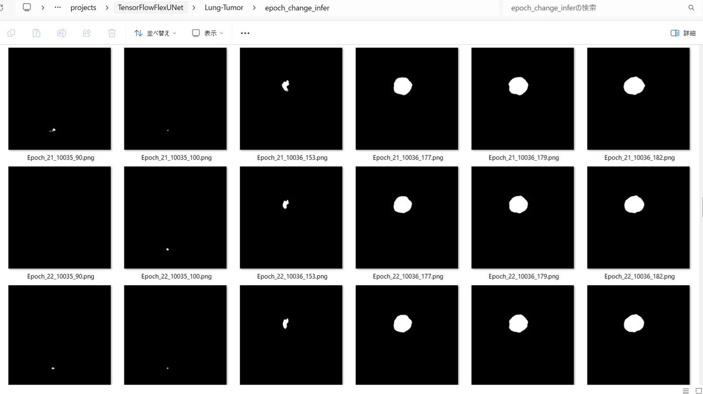

<h2>TensorFlow-FlexUNet-Image-Segmentation-Lung-Tumor (2025/07/31)</h2>

This is the first experiment of Image Segmentation for Lung-Tumor SingleClass based on our TensorFlowFlexUNet 
(TensorFlow Flexible UNet Image Segmentation Model for Multiclass) and a 512x512 pixels 
<a href="https://drive.google.com/file/d/1wxMmnE5IceFivyLcfsr1EsiXOllDLXuv/view?usp=sharing">Lung-Tumor-ImageMask-Dataset.zip</a>.
which was derived by us from  
<a href="https://drive.google.com/file/d/1I1LR7XjyEZ-VBQ-Xruh31V7xExMjlVvi/view?usp=drive_link">Task06_lung.tar</a>
of 
<a href="https://drive.google.com/drive/folders/1HqEgzS8BV2c7xYNrZdEAnrHk7osJJ--2">google-drive</a> in 
<a href="http://medicaldecathlon.com/">
Medical Segmentation Decathlon (MSD)
</a>

 
 
As demonstrated in our repository <a href="https://github.com/sarah-antillia/TensorFlow-FlexUNet-Image-Segmentation-STARE-Retinal-Vessel">
TensorFlow-FlexUNet-Image-Segmentation-STARE-Retinal-Vessel</a>, our Multiclass TensorFlowFlexUNet, which uses categorized masks, 
can also be applied to single-class image segmentation models. This is because it inherently treats the background as one category and your single-class mask data as a second category. 
In essence, your single-class segmentation model will operate with two categorized classes within our Multiclass UNet framework.
 
 
<b>Acutual Image Segmentation for 512x512 Lung-Tumor images</b> 
As shown below, the inferred masks look very similar to the ground truth masks. 
<table>
<tr>
<th>Input: image</th>
<th>Mask (ground_truth)</th>
<th>Prediction: inferred_mask</th>
</tr>
<tr>
<td></td>
<td></td>
<td></td>
</tr>
<tr>
<td></td>
<td></td>
<td></td>

</tr>
<tr>
<td></td>
<td></td>
<td></td>
</tr>
</table>

 
<h3>1. Dataset Citation</h3>
The original dataset used here has been taken from the following web-site. 
<a href="https://drive.google.com/file/d/1I1LR7XjyEZ-VBQ-Xruh31V7xExMjlVvi/view?usp=drive_link">Task06_lung.tar</a>

of <a href="https://drive.google.com/drive/folders/1HqEgzS8BV2c7xYNrZdEAnrHk7osJJ--2">google-drive</a> in 
<a href="http://medicaldecathlon.com/">
Medical Segmentation Decathlon (MSD)
</a>
  
<b>Data</b> 

All data will be made available online with a permissive copyright-license (CC-BY-SA 4.0), 
allowing for data to be shared, distributed and improved upon. 
All data has been labeled and verified by an expert human rater, and with the best 
effort to mimic the accuracy required for clinical use.   
<b>Citation</b> 
To cite this data, please refer to 
<a href="https://arxiv.org/pdf/1902.09063">https://arxiv.org/abs/1902.09063</a>
  
<b>Target: Lung and tumours</b> 
Modality: CT 
Size: 96 3D volumes (64 Training + 32 Testing) 
Source: The Cancer Imaging Archive 
Challenge: Segmentation of a small target (cancer) in a large image 

 
<h3>
<a id="2">
2 Lung-Tumor ImageMask Dataset
</a>
</h3>
 If you would like to train this Lung-Tumor Segmentation model by yourself,
 please download the dataset from the google drive  
<a href="https://drive.google.com/file/d/1wxMmnE5IceFivyLcfsr1EsiXOllDLXuv/view?usp=sharing">
Lung-Tumor-ImageMask-Dataset.zip</a>.
 
, expand the downloaded ImageMaskDataset and put it under <b>./dataset</b> folder to be
<pre>
./dataset
└─Lung-Tumor
    ├─test
    │   ├─images
    │   └─masks
    ├─train
    │   ├─images
    │   └─masks
    └─valid
        ├─images
        └─masks
</pre>
 
<b>Lung-Tumor Statistics</b> 
 
 
<!--
On the derivation of the dataset, please refer to the following Python scripts: 
<li><a href="./generator/ImageMaskDatasetGenerator.py">ImageMaskDatasetGenerator.py</a></li>
<li><a href="./generator/split_master.py">split_master.py</a></li>
 
-->
Please note that we removed all black empty masks and their corresponding images from the orginal 3D dataset to generate a 
simple and small 2D dataset.
 
 
As shown above, the number of images of train and valid datasets is not so large to use for a training set of our segmentation model.
 
 
<b>Train_images_sample</b> 

 
<b>Train_masks_sample</b> 

 
<h3>
3 Train TensorFlowFlexUNet Model
</h3>
 We trained Lung-Tumor TensorFlowFlexUNet Model by using the following
<a href="./projects/TensorFlowFlexUNet/Lung-Tumor/train_eval_infer.config"> <b>train_eval_infer.config</b></a> file.  
Please move to ./projects/TensorFlowFlexUNet/Lung-Tumor and run the following bat file. 
<pre>
>1.train.bat
</pre>
, which simply runs the following command. 
<pre>
>python ../../../src/TensorFlowFlexUNetTrainer.py ./train_eval_infer.config
</pre>

<b>Model parameters</b> 
Defined a small <b>base_filters = 16 </b> and large <b>base_kernels = (9,9)</b> for the first Conv Layer of Encoder Block of 
<a href="./src/TensorFlowFlexUNet.py">TensorFlowFlexUNet.py</a> 
and a large num_layers (including a bridge between Encoder and Decoder Blocks).
<pre>
[model]
;You may specify your own UNet class derived from our TensorFlowFlexModel
model         = "TensorFlowFlexUNet"
generator     =  False
image_width    = 512
image_height   = 512
image_channels = 3
num_classes    = 2

base_filters   = 16
base_kernels   = (9,9)
num_layers     = 8
dropout_rate   = 0.04
dilation       = (1,1)
</pre>
<b>Learning rate</b> 
Defined a very small learning rate.  
<pre>
[model]
learning_rate  = 0.00005
</pre>
<b>Loss and metrics functions</b> 
Specified "categorical_crossentropy" and <a href="./src/dice_coef_multiclass.py">"dice_coef_multiclass"</a>. 
<pre>
[model]
loss           = "categorical_crossentropy"
metrics        = ["dice_coef_multiclass"]
</pre>
<b>Dataset class</b> 
Specifed <a href="./src/ImageCategorizedMaskDataset.py">ImageCategorizedMaskDataset</a> class. 
<pre>
[dataset]
class_name    = "ImageCategorizedMaskDataset"
</pre>
 
<b>Learning rate reducer callback</b> 
Enabled learing_rate_reducer callback, and a small reducer_patience.
<pre> 
[train]
learning_rate_reducer = True
reducer_factor     = 0.4
reducer_patience   = 4
</pre>
<b>Early stopping callback</b> 
Enabled early stopping callback with patience parameter.
<pre>
[train]
patience      = 10
</pre>

<b>RGB Color map</b> 
rgb color map dict for Lung-Tumor 1+1 classes. 
<pre>
[mask]
mask_file_format = ".png"
; background   black,  tumor:white
rgb_map = {(0,0,0):0, (255,255,255):1}
</pre>

<b>Epoch change inference callback</b> 
Enabled <a href="./src/EpochChangeInfereuncer.py">epoch_change_infer callback</a></b>. 
<pre>
[train]
epoch_change_infer       = True
epoch_change_infer_dir   =  "./epoch_change_infer"
num_infer_images         = 6
</pre>

By using this callback, on every epoch_change, the inference procedure can be called
 for 6 images in <b>mini_test</b> folder. This will help you confirm how the predicted mask changes 
 at each epoch during your training process.    

<b>Epoch_change_inference output at starting (epoch 1,2,3)</b> 
 
 
<b>Epoch_change_inference output at middlepoint (epoch 21,22,23)</b> 
 
 
<b>Epoch_change_inference output at ending (epoch 43,44,45)</b> 
 
 
In this experiment, the training process was stopped at epoch 45 by EarlyStopping callback.  
 
 

<a href="./projects/TensorFlowFlexUNet/Lung-Tumor/eval/train_metrics.csv">train_metrics.csv</a> 
 

 
<a href="./projects/TensorFlowFlexUNet/Lung-Tumor/eval/train_losses.csv">train_losses.csv</a> 
 

 

<h3>
4 Evaluation
</h3>
Please move to <b>./projects/TensorFlowFlexUNet/Lung-Tumor</b> folder, 
and run the following bat file to evaluate TensorFlowFlexUNet model for Lung-Tumor. 
<pre>
./2.evaluate.bat
</pre>
This bat file simply runs the following command.
<pre>
python ../../../src/TensorFlowFlexUNetEvaluator.py ./train_eval_infer_aug.config
</pre>

Evaluation console output: 

  

<a href="./projects/TensorFlowFlexUNet/Lung-Tumor/evaluation.csv">evaluation.csv</a> 
The loss (categorical_crossentropy) to this Lung-Tumor/test was very low and dice_coef_multiclass 
very high as shown below.
 
<pre>
categorical_crossentropy,0.0018
dice_coef_multiclass,0.9991
</pre>
 

<h3>
5 Inference
</h3>
Please move <b>./projects/TensorFlowFlexUNet/Lung-Tumor</b> folder 
,and run the following bat file to infer segmentation regions for images by the Trained-TensorFlowFlexUNet model for Lung-Tumor. 
<pre>
./3.infer.bat
</pre>
This simply runs the following command.
<pre>
python ../../../src/TensorFlowFlexUNetInferencer.py ./train_eval_infer_aug.config
</pre>

<b>mini_test_images</b> 
 
<b>mini_test_mask(ground_truth)</b> 
 

<b>Inferred test masks</b> 
 
 

<b>Enlarged images and masks of 512x512 pixels</b> 

<table>
<tr>
<th>Image</th>
<th>Mask (ground_truth)</th>
<th>Inferred-mask</th>
</tr>

<tr>
<td></td>
<td></td>
<td></td>
</tr>

<tr>
<td></td>
<td></td>
<td></td>
</tr>

<tr>
<td></td>
<td></td>
<td></td>
</tr>

<tr>
<td></td>
<td></td>
<td></td>
</tr>

<tr>
<td></td>
<td></td>
<td></td>
</tr>

<tr>
<td></td>
<td></td>
<td></td>
</tr>
</table>

 

<h3>
References
</h3>

<b>1. A large annotated medical image dataset for the 
development and evaluation of segmentation 
algorithms  </b> 
Amber L. Simpson, Michela Antonelli, Spyridon Bakas, Michel Bilello, Keyvan Farahani,  
Bram van Ginneken, Annette Kopp-Schneider, Bennett A. Landman, Geert Litjens, Bjoern Menze, 
 Olaf Ronneberger, Ronald M. Summers, Patrick Bilic, Patrick F. Christ, Richard K. G. Do,  
 Marc Gollub, Jennifer Golia-Pernicka, Stephan H. Heckers, William R. Jarnagin, Maureen K. McHugo, 
  Sandy Napel, Eugene Vorontsov, Lena Maier-Hein, M. Jorge Cardoso
  
<a href="https://arxiv.org/pdf/1902.09063">
https://arxiv.org/pdf/1902.09063
</a>
 
 
<b>2. Lung tumor segmentation: a review of the state of the art</b> 
Anura Hiraman, Serestina Viriri, Mandlenkosi Gwetu
 
<a href="https://www.frontiersin.org/journals/computer-science/articles/10.3389/fcomp.2024.1423693/full">
https://www.frontiersin.org/journals/computer-science/articles/10.3389/fcomp.2024.1423693/full
</a>

